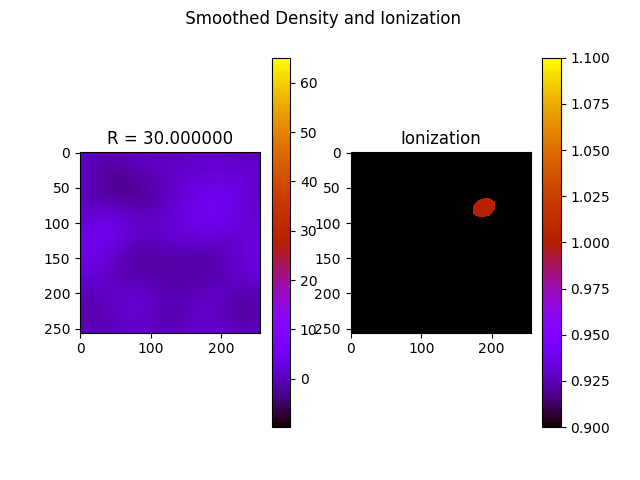

# 21cmpy
PyCUDA implementation of 21cmFAST: in working progress

21cmFAST ([[1]]) is a semi-numerical simulation package for the epoch of reionization. This PyCUDA based implementation aims to improve the original C-code ([[2]]) through the performance benefit of GPU compute and user-friendliness of the Python API. 

This package currently has the following main components (See [[1]] for details. ):

1. initialize.py: Creates initial density and velocity boxes by MRG random generator in Fourier space. Initialization requires a large box (DIM) and a smaller box (HII_DIM). 

2. perturb_field.py: perturb initial density fields to given redshifts via linear or Zeldovich approximations and update the velocities accordingly. (Currently only supports DIM that fit on the GPU. )

3. find_HII_bubbles.py: Excursion set algorithm, also called Fast Fourier Radiative Transfer (FFRT) to paint ionization fields based on density fields. (see attached gif for sample 2d slice in this process). 

4. delta_T.py: computes brightness temperature and 21cm power spectrum. 



## Sample Usage
This package is still in working progress. 
Current sample usage is as follows:

```
git clone 21cmpy ./Py21cm
```


First modify INIT_PARAMS.py, then outside of the directory
```
python -m Py21cm.Programs.initialize
python -m Py21cm.Programs.perturb_field
python -m Py21cm.Programs.find_HII_bubbles
python -m Py21cm.Programs.delta_T
```


## Dependencies

```
numpy, matplotlib, pycuda, cosmolopy
```
**References**

[[1]](https://arxiv.org/abs/1003.3878) 21cmFAST: A Fast, Semi-Numerical Simulation of the High-Redshift 21-cm Signal. Andrei Mesinger, Steven Furlanetto, Renyue Cen arXiv:1003.3878

[[2]](https://github.com/andreimesinger/21cmFAST) 21cmFast code by Andrei Messinger

[[3]](https://github.com/pritchardjr/tocmfastpy) tocmfastpy by Jonathan Pritchard
